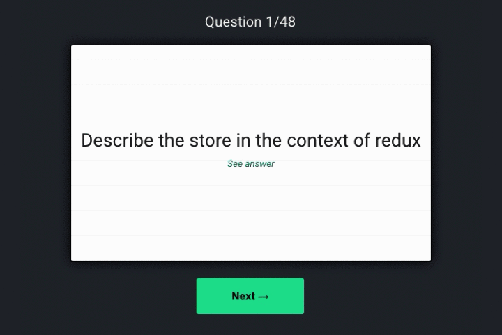

# Lambda Cards

## Overview
Lambda Cards is a flashcards web app designed to study for the [Lambda School](https://lambdaschool.com/) web core interview. It shows the student a random question using [Fisher-Yates](https://en.wikipedia.org/wiki/Fisher%E2%80%93Yates_shuffle), encourages the student to use [active recall](https://en.wikipedia.org/wiki/Active_recall) to answer the question, and uses card flipping functionality to display the answer in the back of the card.

Check it out at [lambdacards.com](http://www.lambdacards.com)

## Getting Started
The base technologies are JavaScript, HTML and CSS. The frontend leverages [React](https://reactjs.org/), the backend uses [Express](https://expressjs.com/) and [SQLite](https://www.sqlite.org/index.html) and the app lives on [Heroku](heroku.com).

### Developer Instructions
1. Create a forked copy of this project
1. Clone a version to your local repository
1. From the root directory in your terminal:
    1. Download the server dependencies by running `npm install`
    1. Seed the database with `knex seed:run`
    1. Start up the server by running `npm run server`
1. From the frontend directory in your terminal:
    1. Download the frontend dependencies by running `npm install`
    1. Start up the app by running `npm start`
1. Happy hacking... and when you're ready, share it or pull request me!

## Feedback
If you've made it this far, I bet you have some feedback (ideas, insights, improvements, criticisms, maybe even a good ol' fashioned rant). I would welcome any and all of it. I like being the filter of my noise so even if you think it may not be useful, send it along. I'll be grateful.

Thanks for checking out the project.
