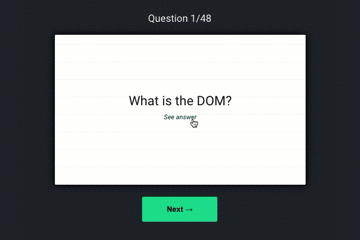

# Lambda Cards

## Overview
Lambda Cards is a flashcards web app designed to study for the [Lambda School](https://lambdaschool.com/) web core interview. It shows the student a random question using [Fisher-Yates](https://en.wikipedia.org/wiki/Fisher%E2%80%93Yates_shuffle), encourages the student to use [active recall](https://en.wikipedia.org/wiki/Active_recall) to answer the question, and uses card flipping functionality to display the answer in the back of the card.

[Check it out here](lambdacards.com)

## Getting Started